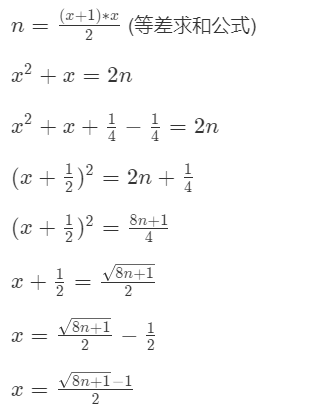

## 每日一题 - 441 排列硬币

### 信息卡片

- 时间：2020-04-05
- 题目链接：https://leetcode-cn.com/problems/arranging-coins/
- tag：`二分法` 
- 难度：简单

### 题目描述

```
你总共有 n 枚硬币，你需要将它们摆成一个阶梯形状，第 k 行就必须正好有 k 枚硬币。

给定一个数字 n，找出可形成完整阶梯行的总行数。

n 是一个非负整数，并且在32位有符号整型的范围内。

示例 1:

n = 5

硬币可排列成以下几行:
¤
¤ ¤
¤ ¤

因为第三行不完整，所以返回2.
示例 2:

n = 8

硬币可排列成以下几行:
¤
¤ ¤
¤ ¤ ¤
¤ ¤

因为第四行不完整，所以返回3.


```

### 参考答案


### 模拟法

解题思路：

num是为了计算第k行需要的数：

- 当n满足num的个数，表示可以形成第k层

- n的总数减去第k层所需的num

- num+1 为第k+1层所需的num

```python

class Solution:
    def arrangeCoins(self, n: int) -> int:
        num = 1
        res = 0
        while num <= n:
            res +=1
            n -=num
            num +=1
        return res
        
```

###数学方法：

解题思路：



```python

class Solution:
    def arrangeCoins(self, n: int) -> int:  
        return int(((8 * n + 1) ** 0.5 - 1) // 2)

 
```


### 其他优秀解答
```
暂无
```
相关题目


