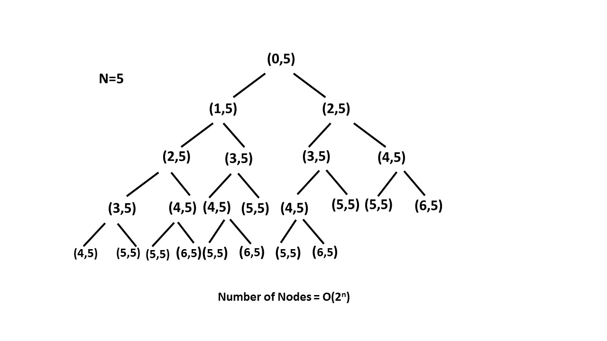

## 每日一题 - 70. 爬楼梯

### 信息卡片

- 时间：2020-04-08
- 题目链接：https://leetcode-cn.com/problems/climbing-stairs/
- tag：`动态规划`
- 难度：简单

### 题目描述

```

假设你正在爬楼梯。需要 n 阶你才能到达楼顶。

每次你可以爬 1 或 2 个台阶。你有多少种不同的方法可以爬到楼顶呢？

注意：给定 n 是一个正整数。

示例 1：

输入： 2
输出： 2
解释： 有两种方法可以爬到楼顶。
1.  1 阶 + 1 阶
2.  2 阶
示例 2：

输入： 3
输出： 3
解释： 有三种方法可以爬到楼顶。
1.  1 阶 + 1 阶 + 1 阶
2.  1 阶 + 2 阶
3.  2 阶 + 1 阶


```

### 参考答案

#### 二分法+双指针

**算法思路**:

对于这个问题主要就是怎么把这个问题拆解成一系列小问题，从一系列小问题再去
结果得到最优的结果。

我们抽象的看一下到第i阶楼梯，想到达第i阶楼梯可以从两个地方到达第i阶：

- 在第 (i-1) 阶后向上爬一阶。

- 在第 (i-2) 阶后向上爬二阶。

所以到达第 i 阶的方法总数就是到第 (i-1) 阶和第 (i-2) 阶的方法数之和。

令 dp[i] 表示能到达第 i 阶的方法总数：

dp[i]=dp[i-1]+dp[i-2]


突然感觉可以用递归来解决，递归的计算，但是递归会带来很大的时间复杂度。看下图：


看上图可以看出递归之所以浪费时间，是因为计算了很多重复的相同计算，
所以我们可以将相同的计算都存储起来，这样重复的计算就可以不会重复计算了。


```python
/*
 * @lc app=leetcode id=70 lang=python
 *
 * [70] 爬楼梯
 */

class Solution:
    def climbStairs(self, n: int) -> int:
        reslut =  list(range(n+1))
        for i in range(1,n+1):
            if i == 1:
                reslut[i] = 1
            elif i == 2:
                reslut[i] = 2
            else: reslut[i] = reslut[i-1] + reslut[i-2]
        return reslut[-1]
		
		
```

时间复杂度：O(n)，单循环到 n 。

空间复杂度：O(n)，dp 数组用了 n 的空间。


### 其他优秀解答

```
暂无
```


