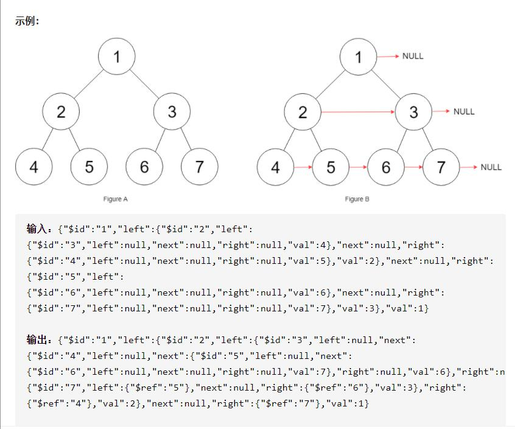

## 每日一题 - 116. 填充每个节点的下一个右侧节点指针

### 信息卡片

- 时间：2020-11-22
- 题目链接：https://leetcode-cn.com/problems/flatten-binary-tree-to-linked-list/
- tag：`二叉树、递归遍历'
- 难度：中等


### 题目描述

```
给定一个完美二叉树，其所有叶子节点都在同一层，每个父节点都有两个子节点。二叉树定义如下：

struct Node {
  int val;
  Node *left;
  Node *right;
  Node *next;
}
填充它的每个 next 指针，让这个指针指向其下一个右侧节点。如果找不到下一个右侧节点，则将 next 指针设置为 NULL。

初始状态下，所有 next 指针都被设置为 NULL。

```


### 参考答案

**层次遍历：**

对于使用层次遍历，其实不难想到，这里不同于层次遍历的一点在于原来的层次遍历
对于每一层没有明确的分割点，也就说并不知道那些节点属于同一层。

对于这道题很明显是需要知道这个条件的，因此需要我们每次遍历时，要保证每一次是
不同层的节点，即每次遍历quee都是同一层的节点

于是我们遍历quee，将前后节点进行相连即可。

```
class Solution:
    def connect(self, root: 'Node') -> 'Node':
        if not root:return None
        quee=[root]
        while quee:
            lenght = len(quee)
            for i in range(lenght):
                node = quee.pop(0)
                if i < lenght-1:
                    node.next = quee[0]
                if node.left:
                    quee.append(node.left)
                if node.right:
                    quee.append(node.right)
        return root
```


**借用next指针：**
 
这道题的是将同一层的节点进行一个横向连接，而这其中关键在于除了连接同一个节点
下的左右根节点以外还要连接不在同一个根节点但是在同一层的其他节点。

因此，这时候其实就可以借用next指针，判断根节点是否存在兄弟节点，如果存在那么
就要将右节点的next指向其父节点的兄弟节点的左节点。
 
 ```
class Solution:
    def connect(self, root: 'Node') -> 'Node':
        if not root:return None
        left = root
        while left.left:
            head = left
            while head:
				#同一节点下的左右节点
                head.left.next = head.right
				#不同节点下的节点，将左子树的右节点的next指向下一子树的左节点
                if head.next:
                    head.right.next = head.next.left
                #移动到下一个子树
                head = head.next
            left = left.left # 进行下一层的遍历
        return root
           
 ```

### 其他优秀解答

```
暂无
```
 