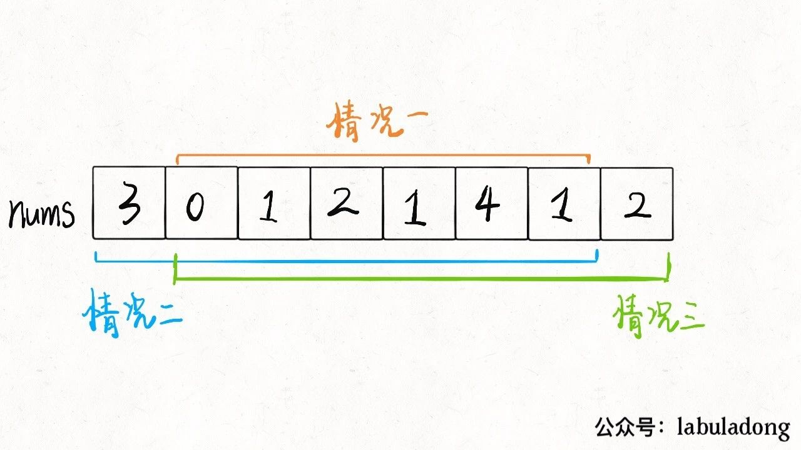

## 每日一题 - 213. 打家劫舍 II

### 信息卡片

- 时间：2020-12-13
- 题目链接：https://leetcode-cn.com/problems/house-robber-ii/
- tag：`动态规划`
- 难度：中等


### 题目描述

```
你是一个专业的小偷，计划偷窃沿街的房屋，每间房内都藏有一定的现金。这个地方所有的房屋都 围成一圈 ，这意味着第一个房屋和最后一个房屋是紧挨着的。同时，相邻的房屋装有相互连通的防盗系统，如果两间相邻的房屋在同一晚上被小偷闯入，系统会自动报警 。

给定一个代表每个房屋存放金额的非负整数数组，计算你 在不触动警报装置的情况下 ，能够偷窃到的最高金额。

 

示例 1：

输入：nums = [2,3,2]
输出：3
解释：你不能先偷窃 1 号房屋（金额 = 2），然后偷窃 3 号房屋（金额 = 2）, 因为他们是相邻的。
示例 2：

输入：nums = [1,2,3,1]
输出：4
解释：你可以先偷窃 1 号房屋（金额 = 1），然后偷窃 3 号房屋（金额 = 3）。
     偷窃到的最高金额 = 1 + 3 = 4 。
示例 3：

输入：nums = [0]
输出：0
 
```

### 参考答案

### 动态规划

这道题采用的是动态规划的思想

**分析：**

这道题对于198那道题来说区别在于如何数组是一个环形的，也就是说考虑最后一个的时候
在考虑到第一个的位置。

也就是说，现在第一间房子和最后一间房子也相当于是相邻的，不能同时抢。
比如说输入数组nums=[2,3,2]，算法返回的结果应该是 3 而不是 4，因为开头和结尾不能同时被抢。

首先，首尾房间不能同时被抢，那么只可能有三种不同情况：要么都不被抢；要么第一间房子被抢最后一间不抢；
要么最后一间房子被抢第一间不抢。不过仔细一想，其实第一种情况已经包含在情况2或3中了



因此只需要比较情况2和3，找出最大值，就是最终答案。

```
class Solution:
    def rob(self, nums: List[int]) -> int:
        n = len(nums)
        if n==1:return nums[0]
        return max(self.dp(nums[0:n-1]),self.dp(nums[1:n]))
    
    def dp(self,num):
        dp_1 = dp_2 = dp =0
        for i in range(len(num)-1,-1,-1):
            dp = max(dp_1,dp_2+num[i])
            dp_2 = dp_1
            dp_1 = dp
        return dp
```


### 其他优秀解答

```
暂无
```
 